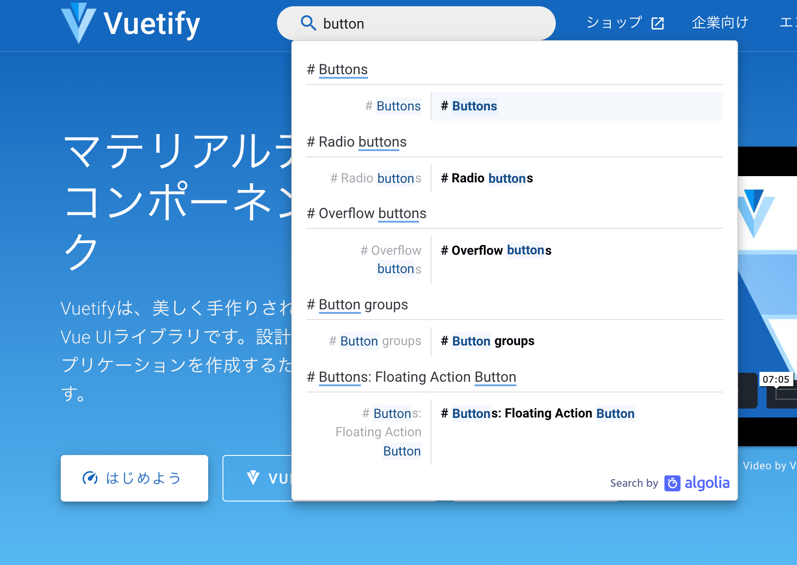
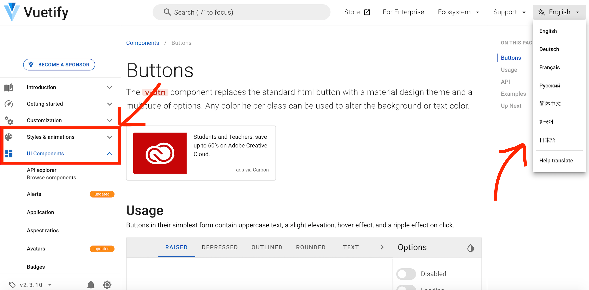
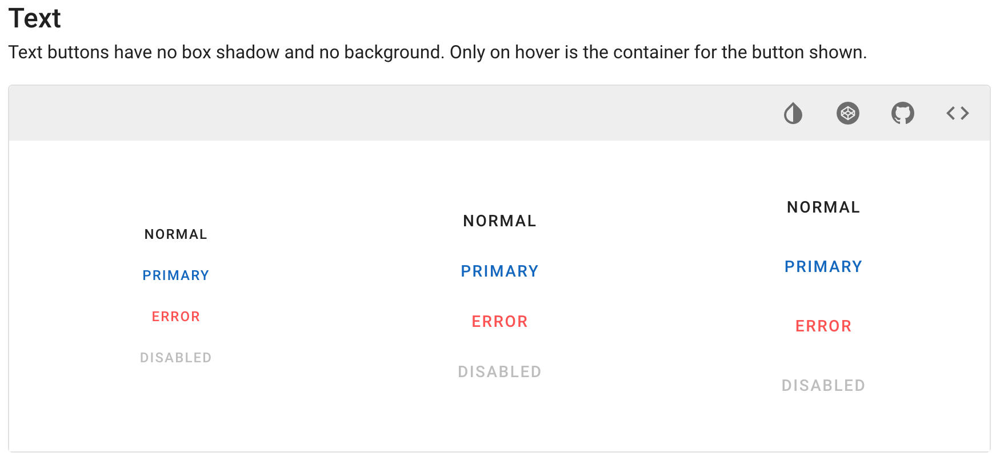
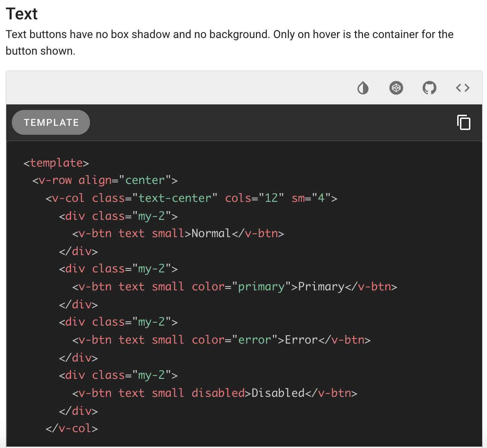
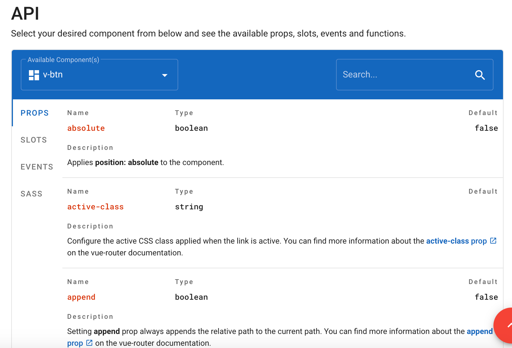
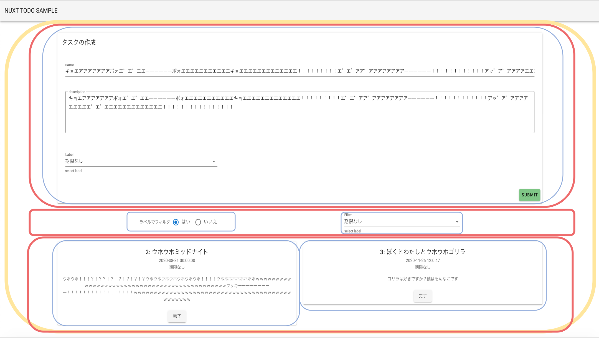
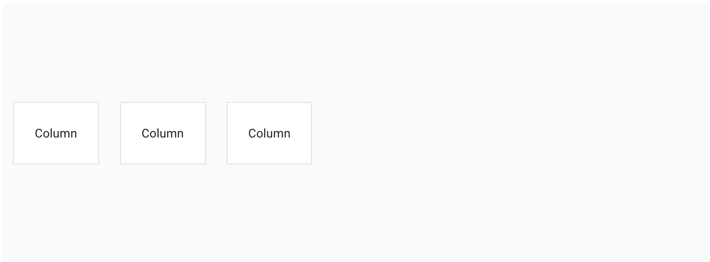
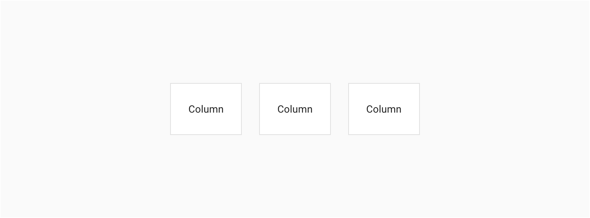
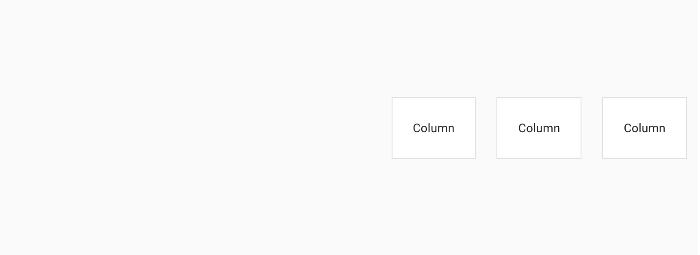
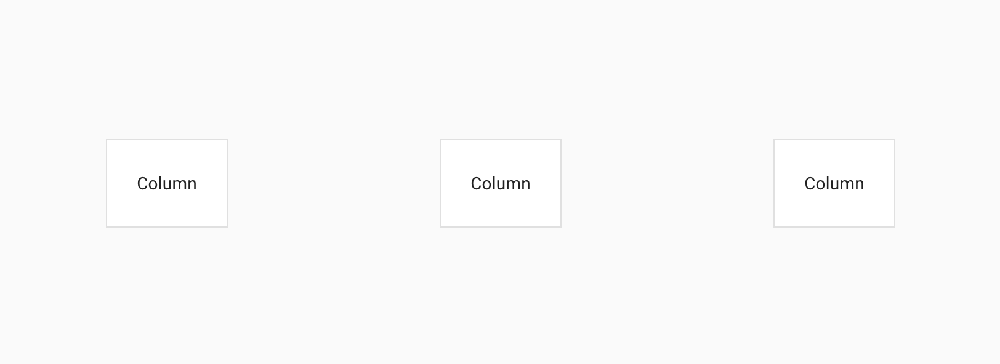

# 30 分でわかれ Vue.js 応用編

## はじめに

このドキュメントでは，初級編(？)で触れられなかったことについて補足していきます．最後まで頑張ってついてきてください．

## 新しく覚えて欲しい概念

### Nuxt.js

便利になって帰ってきた Vue.js（お一人様で開発する時は新しく覚える操作がそれなりにあるが，チームの中で一人でも nuxt が使える人間がいれば，あとはその人が作ったテンプレートに従うだけなので，新しく覚えることは**ほぼ無い**．）（やることにもよるけど．）

### Vuetify.js

UI フレームワーク．要するに，これを使えば便利でインスタ映えするタグが大量に追加され，**アホほど楽に綺麗な Web サイトが作れる**．（もちろん新しく覚えることはそれなりにあるのだけれど，まあ大したことはない．）

## Nuxt.js を使うと今までと何が違ってくるか

```
・Vuex Store の使い方が微妙に変わる
・.env.development が env.development.js になって書き方が変わる
```

**以上**．基本的にはどうやっても Vue.js なので大差ない．

問題は，Vuetify.js の導入による変化である．

## Vuetify.js を使うと今までと何が違ってくるか

**HTML 部分の全部**（JavaScript 部分に変更はない）

ソースコードを実際に見てもらえればわかるが，今まで input だの p だの table だの a だのクッッッッッッッッッッッッソダサいタグが使われていたのが，全て v-card だの v-select だの v-radio-group といった謎の新しいタグに置き換わっている．これらは，Vuetify を導入すると使用できる，見た目が**モダン**なタグである．

「こんなの見たことがない．どうやって使えば良いんだ？」と思ったはずなので，どうするべきか書いていく．

## ドキュメントを読みなさい

**決して投げやりになったわけではない**．理由はちゃんとある．Vue.js をきちんと学ぶことは，他の React などの JavaScript のフレームワークを学ぶ土台になったり，Web フロントエンジニアとして作業をするのに役立つことに繋がったりする．そもそも，Vue.js はちゃんと学ばなければ，動作原理をちゃんと理解しながらソースコードを書くことはできない．

一方，Vuetify.js を学ぶということは，**つまるところ「こう書けばこういう見た目のパーツが現れて，パーツに対してこういう設定ができる」ということを学ぶことを延々と繰り返すだけである**．学べることの価値が Vue.js と比べて薄い．Vuetify.js を使うことによって得た経験は他でも役に立つかもしれないが，Vuetify.js の知識は基本的に Vuetify.js の中でしか使えない．

学べることの価値が薄いのに，全てのタグについてきっちり学んで Vuetify を完全に理解する…ということは，UI フレームワークを作りたい人や好きな人以外にとっては時間の無駄である．ただ Web アプリケーションを作りたいだけならそんなことをする必要はない．

Vuetify を使う際は，使いたいパーツに関することを使いたい時に調べ，サクサクっと気持ち程度に理解することを意識しよう．（そもそも，CSS で 1 からデザインする時間や手間を省くために UI フレームワークを使っているのに，その UI フレームワークにめちゃくちゃ時間を取られていては本末転倒もいいところである．）

## ドキュメントの読み方

とはいえ，そもそもドキュメントの読み方がわからなければ手をつけることさえできない．この節では，Vuetify のドキュメントの読み方について少し解説をする．

まず，公式ドキュメントを見ながら，使いたいパーツを考えたり，適当に探したりする．

公式ドキュメントは<a href="https://v2.vuetifyjs.com/ja/">ここ</a>．

今日はボタンが欲しい気分なので，Button で検索．



これがドキュメントの実際の画面である．(<a href="https://v2.vuetifyjs.com/en/components/buttons/#buttons">ここ</a>)



英語だが，右上の English から日本語にすることができる．

また，左のメニューの UI Components は，使えるパーツ一覧の様なものである．Styles & animations の中には，見た目に関する設定の記事が入っている．（Styles & animations はたまに見ることになる）

ドキュメントの下の方に，この様なサンプルがある．



右上の<>マークを押せば，ソースコードが見られる．



要するに，**このソースコードをまんまコピペしたらサンプルがそのまま使えるということである**．このサンプルとソースコードを有効に活用することによって，楽に理解と学習を行うことができる．

また，少し下に下がると，API というものが見つかる．



これは，そのタグで設定できる設定項目の一覧である．（全部を理解する必要はない．サンプルを見ながら，この設定について詳しく知りたいと思った時にだけ使えばよい．）

## Vuetify のわかりにくい点について

比較的扱いやすい Vuetify だが，初見ではわかりにくいところも少しある．それについて解説していく．

### v-card

**これで包んでおけば大体なんとかなる**．本サンプルでは，タスク登録フォーム全体や，タスクひとつひとつがカードとなっている．

v-card は，v-card-title と v-card-subtitle と v-card-text と v-card-actions という 4 つのゾーンに分けることができる（分けなくてもいい）

分けると，**ちょっとソースコードが読みやすくなる気がする．**（v-title は CSS の効果で文字がタイトルっぽくなる効果がある．他にもなんらかの効果があった気がするが，**忘れた**）

v-card に関する詳しい説明は<a href="https://v2.vuetifyjs.com/ja/components/cards/">ここ</a>

### グリッドシステム．

**つまり，こういうこと．**(黄色が v-container，赤が v-row，青が v-col.)



v-container が全ての親，v-row が行．v-col が列である．

まず全体が v-container に包まれていて，タスク登録フォームの行，フィルタの行，タスクの行という 3 つの巨大な行が存在している．

タスク登録フォームの行の中には，クソでかい 1 つの列が存在している．その中に v-card が入っており，v-card-text の中は，名前入力の行と説明入力の行とラベル選択の行が入っている．（つまり，グリッドの入れ子になっている．1 つの列の中を，また行と列で刻んでいるということである．）

フィルタの行には，2 つの列が入っている．フィルタを使用するかどうか選択する列とフィルタを選ぶ列である．

タスクの行の中には，タスクの数だけタスクの列が入っている．1 つのタスクの列は画面の横半分の長さである．（そのため 3 つ以上タスクが存在していると画面外にはみ出すのだが，それでは困るので Vuetify が勝手に下に並べてくれている．）

### v-row

行ひとつ分．この中に v-col を好きなだけ入れていく．

justify="center" align="center"という設定項目を設定している v-row がある．

justify は，横方向についてどう並べるか決める．

`justify="start"`


`justify="center"`


`justify="end"`


`justify="space-around"`


align は，justify の縦方向バージョン．

両方とも，詳しくは<a href="https://v2.vuetifyjs.com/ja/components/grids/">ここ</a>のプレイグラウンドで見ることができる．

### v-col

列ひとつ分．

cols="(数字)"という設定をしなければならない．これは，画面の横の長さを 12 等分した時に，どのぐらいの横幅の割合を使用するかということを定義する設定項目である．わかりにくいのでちゃんと説明する．

例えば，Task.vue を見てみると，タスクのカードひとつ分の v-col の cols は 6 である．これは，タスクのカードの横幅は 6/12（つまり，画面の半分）ということを意味している．（実際，画面の半分よりいくらか小さいのだが，まあ大体半分である．）

## おまけ（と言いながら有用な話）

**store 内の変数を v-bind（もしくは v-model） したい時があると思う**．store 内の変数が変更された時に，それに合わせて HTML で表示する値も切り替えたり，HTML の input 等で値に変化があった時に，v-model によって store 内の変数を上書きしたいシチュエーションだ．当サンプルの場合，「store 内の NowFilter（変数）を，ユーザのフィルタ切り替え操作によって v-model で変更する」という処理が該当する．

ところが，基礎の方で述べた通り，store では mutations という特殊な関数を解さなければ state の変数に代入することはできない．では，一体どう書けばいいのだろうか？

computed の中に，このように定義する:

```
NowFilter: {
    get() {
        return this.$store.state.NowFilter
    },
    set(value) {
        this.$store.commit('setNowFilter', value)
    },
},
```

大体見ての通りだが，要するに，「**こう書くことによって，store 内の変数も v-bind や v-model することができるようになる**」ということがわかればそれで十分だ．

## さいごに

今回，vue ファイルにはコメントによる解説を一切行っていない．基本からここまで全部読んできたなら，ソースコードを見ればなんとなくわかるはずであるし，Vuetify に関することでわからないことがあれば，上記の通りドキュメントを読めばいいからである．

とにかく，ドキュメントを読むように．ドキュメントを読んでもわからなければ，Vuetify は検索すればいくらでも情報が出てくる．
